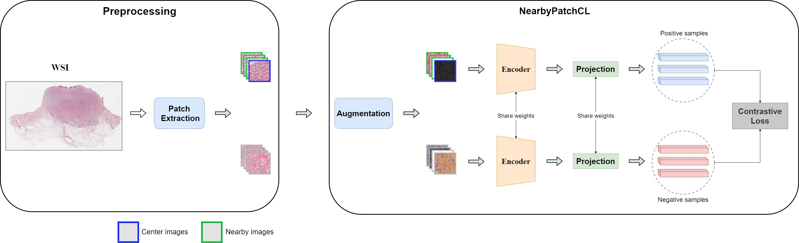
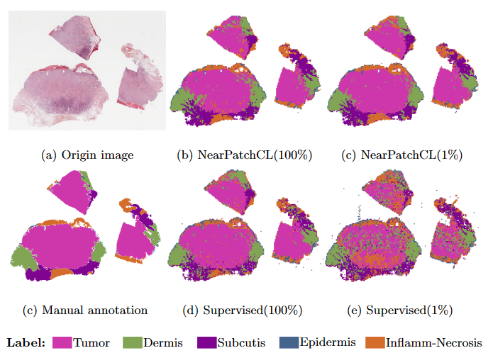
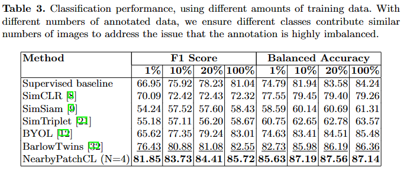

# Nearby Patch Contrastive-Learning

## Overview
This repository hosts the official PyTorch implementation of NearbyPatchCL: Leveraging Nearby Patches for Self-Supervised Patch-Level Multi-Class Classification in Whole-Slide Images as presented in the International Conference on Multimedia Modeling 2024.

<div align="left">

  [[`ArXiv Paper`](https://arxiv.org/abs/2312.07489)]
  [[`Colab Notebook`](https://colab.research.google.com/drive/1GQrt6WA9rFhiGy2nI5eE9fRTE7-5TdQR?usp=sharing)]

  

</div>

## <div align="center"> 📝 Documentation </div>

### Installation
This source code has been developed and tested with `python==3.10.12`, as well as `pytorch=2.1.0+cu118` and `torchvision==0.16.0+cu118`. We recommend using the [conda](https://docs.conda.io/en/latest/) package manager for installation.

1. Clone this repo.
```sh
git clone https://github.com/nvtien457/NearbyPatchCL.git
```

2. Install dependencies with conda (we provide script [`scripts/install.sh`](./scripts/install.sh)).
```sh
conda create -n nearby python=3.10
conda activate nearby
bash scripts/install.sh
```

### Dataset

<!-- 1. Download CATCH dataset from https://wiki.cancerimagingarchive.net/pages/viewpage.action?pageId=101941773. Both Tissue Slide Images and Annotations are required.

2. Install openslide from https://openslide.org/download/

3. Run scripts -->

Dataset is cropped from Tissue Slide Images provided by [CATCH dataset]():

+ [Train set](https://1drv.ms/f/s!AiJYp4kpGfDdgYxWIaBluCqv8GiwLg?e=vByJMQ)

+ [Finetune set](https://studenthcmusedu-my.sharepoint.com/:u:/g/personal/19125079_student_hcmus_edu_vn/EYM3yOR5X69AhvlbYIW-FeIB1X0BOYhKWXHWjJg7ElI-hg?e=wvgjjo)

+ [Test set](https://studenthcmusedu-my.sharepoint.com/:u:/g/personal/19125079_student_hcmus_edu_vn/Edn14ViXfSdGhw47RS5KXjkB3apJagBvU-Gn9TodKkq6yw?e=J8q2N8)

+ [Pretrain model](https://studenthcmusedu-my.sharepoint.com/:f:/g/personal/19125079_student_hcmus_edu_vn/Er_jhqx23DBFoKNO_e3OYSgBYcRjYAUOjHZLJ7IqPuvmOA?e=gSIAUb)

<!-- | | Center | Nearby |
| :- | --: | --: |
| PCATCH-0 | 247,000 | 0 |
| PCATCH-1 | 123,500 | 123,500 |
| PCATCH-2 | 82,254 | 164,502 |
| PCATCH-4 | 49,400 | 197,600 |
| PCATCH-8 | 27,417 | 246,753 | -->

Dataset folder structure
```
├── data
|   ├── TRAIN_SET
|   |   ├── Histiocytoma
|   |   ├── MCT
│   │   ├── Melanoma
│   │   ├── PNST
│   │   ├── Plasmacytoma
│   │   ├── SCC
│   │   ├── Trichoblastoma
|   ├── TRAIN_SET_NEAR_0
|   ├── TRAIN_SET_NEAR_2
|   ├── ...
|   ├── TRAIN_SET_NEAR_8
|   ├── TRAIN_VAL_SET
|   |   ├── Dermis
|   |   ├── Epidermis
|   |   ├── Inflamm-Necrosis
|   |   ├── Subcutis
|   |   ├── Tumor
|   |   ├── bg
|   └── TEST_SET
```

- Image name format in **TRAIN_SET**: 
```[WSI_filname]_patch_[patch_id]_[x]_[y].jpg```

ex: Histiocytoma_01_1_patch_000_112_60.jpg

- Image name format in **TRAIN_SET_NEAR_***: 
```[WSI_filename]_patch_[patch_id]_[nearby_id].jpg```

ex: Histiocytoma_01_1_patch_000_0.jpg

- **TRAIN_SET** and **TRAIN_SET_NEAR_*** share similar structure (7 subfolders for tumors). **TRAIN_SET** contains center patches (nearby_id = 1).

- **TRAIN_VAL_SET** and **TEST_SET** share similar structure (6 classes in skin).


### 1. Pre-train unsupervised
- Use file unsup.sh.
- Determine the path of logs, checkpoints, data folder.
- Config setting for training is saved in .yaml file.

```
!python train_unsupervised.py \
    -c ./configs/SimCLR_unsup.yaml \
    --data_dir /content \
    --ckpt_dir path \
    --log_dir path
```

- To train method NearbyPatchCL(N=X), use config files NEAR_X_D.yaml

### 2. Finetune

- Use file finetune.sh

```
!python train_linear.py \
    -c ./configs/finetune.yaml \
    --data_dir Path 
```

### 3. Fully-supervised training
- Use file **sup.sh**. 
- Determine the path of logs, checkpoints, data folder.
- Config setting for training is saved in **.yaml** file.

```
!python train_supervised.py \
    -c ./configs/SimCLR_unsup.yaml \
    --data_dir /content \
    --ckpt_dir path \
    --log_dir path
```

### 4. Evaluation
- Use file test.sh

```
!python test.py \
    -c ./configs/test.yaml \
    --test_dir Path
```


## <div align="center"> 📈 Result </div>
<div align="center">
  
</div>

<div align="center">
  
</div>

## <div align="center"> ℹ Citation </div>
If our code or paper is helpful to your work, please give us star and consider citing:

```bibtex
@inproceedings{NearbyPatchCL,
  title        = {NearbyPatchCL: Leveraging Nearby Patches for Self-Supervised Patch-Level Multi-Class Classification in Whole-Slide Images},
  author       = {Le, Gia-Bao and Nguyen, Van-Tien and Le, Trung-Nghia and Tran, Minh-Triet},
  year         = 2024,
  book         = {MMM 2024 - The 30th International Conference on Multimedia Modeling}
}
```

<!-- ```bash
├── README.md
├── augmentations
│   ├── __init__.py
│   ├── byol_aug.py
│   ├── moco_aug.py
│   └── simclr_aug.py
|
├── configs
│   ├── BYOL_unsup.yaml
│   ├── MoCo_unsup.yaml
│   ├── SimCLR_unsup.yaml
│   ├── SimSiam_unsup.yaml
│   └── SimTriplet_unsup.yaml
|
├── data
|
├── datasets
│   ├── __init__.py
│   └── catch_dataset.py
|
├── losses
│   ├── NT_Xent.py
│   ├── __init__.py
│   └── neg_cosine.py
|
├── models
│   ├── __init__.py
│   ├── byol.py
│   ├── moco.py
│   ├── simclr.py
│   ├── simsiam.py
│   └── simtriplet.py
|
├── optimizers
│   ├── __init__.py
│   ├── larc.py
│   ├── lars.py
│   ├── lars_simclr.py
│   └── lr_scheduler.py
|
├── tools
│   ├── __init__.py
│   ├── accuracy.py
│   ├── arguments.py
│   ├── average_meters.py
│   ├── file_exist_fn.py
│   ├── knn_monitor.py
│   ├── logger.py
│   └── plotter.py
|
├── trainer
│   ├── __init__.py
│   ├── byol.py
│   ├── moco.py
│   ├── simclr.py
│   ├── simsiam.py
│   └── simtriplet.py
|
├── train_unsupervised.py
└── unsup.sh
``` -->

<!-- - Dùng hàm get_aug trong thư mục **`augmentations`** để khởi tạo TwoCropsTransform(transform) (2 transforms cùng 1 lúc). Hiện tại đã implement được Moco, SimCLR, BYOL.

- Thực hiện chỉnh sửa các tên, biến cần truyền vào của (model, augmentation, loss, dataset, optimizer, train) ở trong các file .yaml trong thư mục **`configs`**.

- Thư mục **`data`** chứa các dataset folder, trong mỗi folder chứa các file .txt (đường dẫn tới ảnh).

- Dùng hàm get_criterion trong thư mục **`losses`** để khởi tạo Criterion. Ngoài ra còn implement các hàm loss không có sẵn trên Pytorch.

- Trong thư mục **`models`**, dùng hàm get_model để khởi tạo model, get_backbone để khởi tạo backbone (nếu muốn giữ y nguyên backbone gốc thì castrate = False trong config).

- Trong thư mục **`optimizers`**, dùng hàm get_optimizer để khởi tạo optimizer, get_scheduler để khởi tạo scheduler. Hiện mới có LRScheduler được implement, warmup_epoch có thể bằng 0.

- Thư mục **`tools`** chứa đủ thứ: accuracy, argument, logger, meter, ...

- Thư mục **`trainer`** dùng để xác định cách mỗi model sẽ lấy data từ dataloader, forward, trả về những gì, tính accuracy sao, ... Trả về đều dưới dạng dict, luôn có 1 key loss.

# 1. Train unsupervised setting

- Sử dụng file train_unsupervised.py. 
- XÁC ĐỊNH các đường dẫn tới logs, checkpoints, data folder trước khi train.
- Kiểm tra lại file .yaml (trong folder configs) được dùng.

```
!python train_unsupervised.py \
    -c ./configs/SimCLR_unsup.yaml \
    --data_dir /content \
    --ckpt_dir ../NVT_checkpoints \
    --log_dir ../NVT_logs
``` -->
